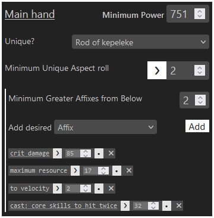
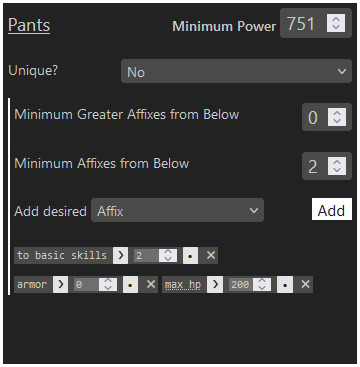

# d4lf-editor
 A GUI editor for filters for [D4LF](https://github.com/aeon0/d4lf) - especially good
 at touching up the filters generated by importing from Maxroll.

This GUI editor doesn't give you complete control tto be abe to build out fully
featured D4LF filters, but it does provide more than enough to maintain a full
set of filters for a build, letting you evolve it as you get gear.

### Features

 

- Support for Unique or Legendary items
- Unique Aspect filtering
- Affix listing
  - Will build separate affix lists when you mark individual affix as required or 
    must-be-greater
  - Minimum Affix count (of affixes not marked individually required or 
    must-be-greater)
  - Minimum Greater Affix count (of affixes not marked individually required or
    must-be-greater)
- Unique Aspect and Affix Less or Greater value filtering
- One Filter for every gear slot, any number of extra unique filters
- Full support for Firefox and Chrome
  - though Chrome can save over your filter file, whereas Firefox will download a 
    new file every time as it [lacks support](https://caniuse.com/?search=showSaveFilePicker)
    for any way to save over a file unfortunately

### Usage

An instance runs at [d4lf-editor.zbee.codes](https://d4lf-editor.zbee.codes/), but 
you can also self-host it.

There is a guide available at [`guide.html`](https://d4lf-editor.zbee.codes/guide.html)
that goes over exactly how to use the editor.

#### Self-Hosted

1. Download the latest release from the [tags page](https://github.com/zbee/d4lf-editor/tags)
2. Put the folder up on your server, or even upload the whole folder to Cloudflare 
   Pages, which will just work
3. Open the URL to the `index.html` file in your browser

### Updating

This sees a lot of use in my friend group, so as long as any of us are playing it 
will be up to date with the latest D4LF features.

For small version changes, I just update the variable to the latest version, and 
make sure that `json/` files are updated.

For larger changes (which typically mirror larger changes in Diablo, so I 
typically have a head start), the filters themselves and the code behind them will 
need updated as well, so that can take longer.

## License

Licensed under the GPL-3.0 License. See [LICENSE](LICENSE) for more information.

Uses:
- [js-yaml](https://github.com/nodeca/js-yaml)
- [jquery](https://jquery.com/)
- [FileSaver.js](https://github.com/eligrey/FileSaver.js)
